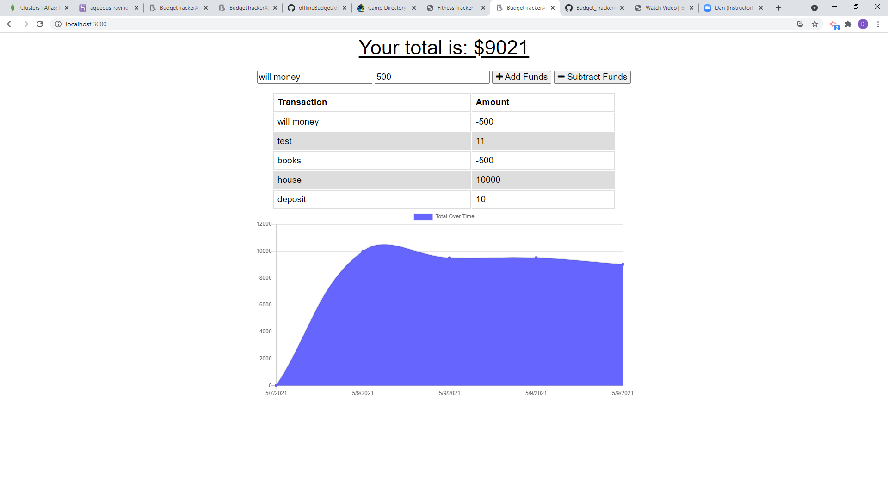

# BudgetTrackerApp

Adding functionality to an existing Budget Tracker application to allow for offline access and functionality via service workers, etc  The user can add expenses and deposits to their budget with or without a connection. When entering transactions offline, they should populate the total when brought back online.  This app is experimenting wiht PWA functionality.

## User Story
AS a busy person
I would like an easy way to track expenses offline or online - on my phone even 

## Screenshot of App

## URLS

  Deployed application: https://aqueous-ravine-16024.herokuapp.com/

  Github repository:  https://github.com/Kassandra14/BudgetTrackerApp

